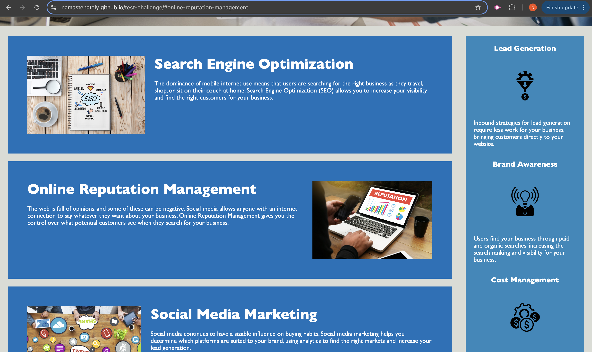
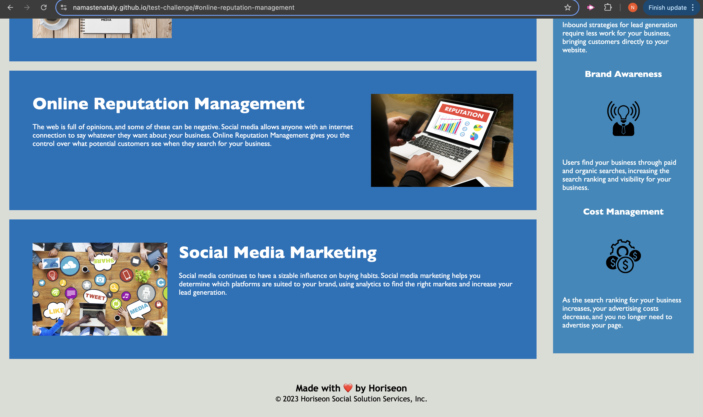

# test-challenge

## Description

The goal of this challenge was to create semantic HTML elements, organize the structure independent of styling and positioning of the HTML elements, added alt attributes to make it more accessible, consolidate the CSS, and add a new concise and descriptive title.

## Screenshot

## Link to working Application
<a href="https://namastenataly.github.io/test-challenge/">Github Pages</a>